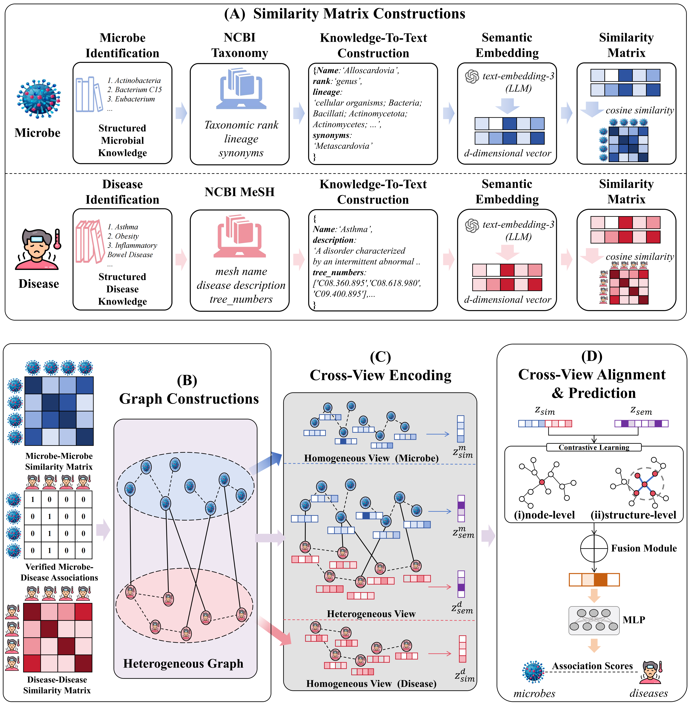

# SSRA-MDA
PyTorch implementation for "SSRA-MDA: ..."

## Overview

In this paper, we introduce a deep learning framework SSRA-MDA(Semantic Representation Alignment for Microbe–Disease Association Prediction), which is designed for predicting potential microbe–disease associations (MDAs).  
The model integrates **structural information from association networks** and **biological semantic knowledge** derived from ontology resources, and aligns the representations from these two views to learn more informative embeddings.

## Framework

<div align="center">
  
</div>

## Usage

The main experiments are implemented in the Jupyter Notebook **mda.ipynb**.

To reproduce the experiments:

1. Clone the repository and install the required packages

```bash
git clone https://github.com/yourusername/SSRA-MDA.git
cd SSRA-MDA

pip install -r requirements.txt
```
2. Open and run mda.ipynb

## Project Structure

```
SSRA-MDA
│
├── HMDAD/               # HMDAD dataset
├── Disbiome/            # Disbiome dataset
├── case-study/          # Case study experiments
│
├── mda.ipynb            # Main notebook for training and evaluation
├── framework.png        # Framework illustration of SSRA-MDA
├── requirements.txt     # Python dependencies
└── README.md
```
